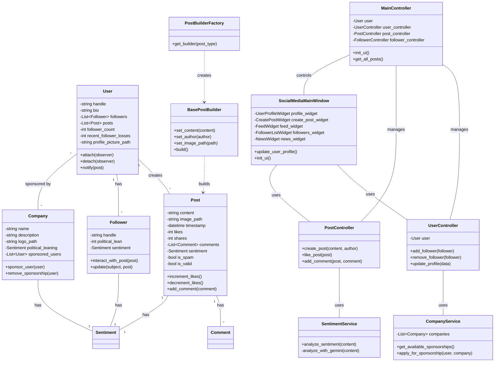
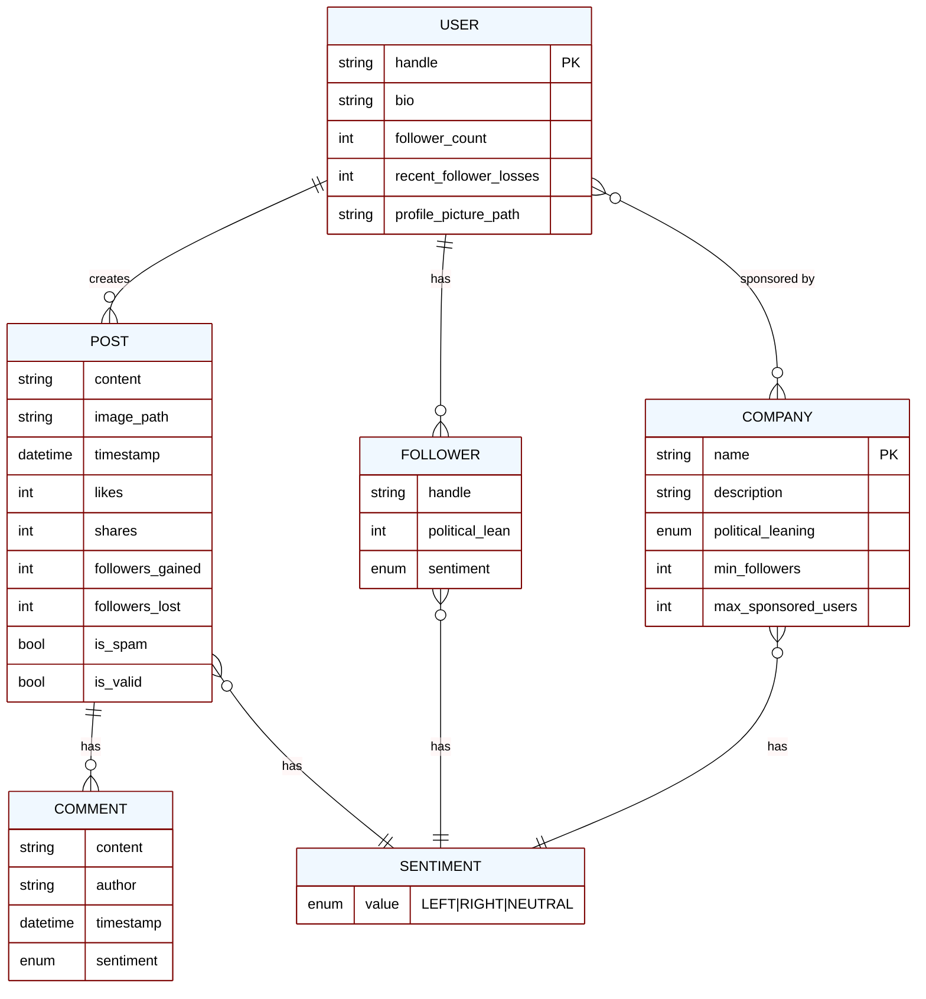

# Social Media Influencer Simulator

A PyQt6-based social media simulator application that demonstrates various software design patterns and principles.

## Overview

This application simulates a social media platform where users can create profiles, make posts with political sentiment analysis, gain followers, and interact with content. It serves as a practical demonstration of software engineering concepts including MVC architecture and various design patterns.

## Features

- **User Profile Management**: Create and customize your social media persona
- **Post Creation**: Create text and image posts with sentiment analysis
- **Sentiment Analysis**: Uses Google Gemini AI to analyze political sentiment of content
- **Follower System**: Gain followers with different political alignments
- **Interactive Feed**: View and interact with posts in your feed
- **Post Interactions**: Like, comment, and share posts
- **Company Sponsorships**: Get sponsored by companies with different political leanings
- **News & Trending**: View news and apply for company sponsorships
- **Theme Switching**: Toggle between light and dark themes

## Architecture

The application follows a Model-View-Controller (MVC) architecture pattern with additional design patterns.
 Here's the class diagram showing the main components and their relationships:



The architecture follows these key principles:

1. **Model Layer**: Contains the core business logic and data structures (`User`, `Post`, `Follower`, `Company`)
2. **View Layer**: Handles the UI components and user interaction (`SocialMediaMainWindow` and its widgets)
3. **Controller Layer**: Manages the interaction between Models and Views (`MainController`, `UserController`, `PostController`)
4. **Services**: Provides specialized functionality (`SentimentService`, `CompanyService`)
5. **Design Patterns**: Implements various patterns for extensibility and maintainability:
   - Factory Pattern for creating post builders
   - Builder Pattern for constructing posts
   - Observer Pattern for follower notifications
   - Command Pattern for post interactions
   - Decorator Pattern for user features
   - Interceptor Pattern for content filtering

## Entity Relationship Diagram

The following diagram illustrates the data model relationships in the Social Media Influencer Simulator:



## Design Patterns Implemented

This project demonstrates several key software design patterns:

1. **Model-View-Controller (MVC)**: Separates the application into three interconnected components
2. **Factory Pattern**: Creates different types of post builders
3. **Builder Pattern**: Constructs complex post objects step by step
4. **Command Pattern**: Encapsulates post interactions as objects
5. **Decorator Pattern**: Adds features to users dynamically (verification, sponsorships)
6. **Interceptor Pattern**: Processes posts before they're created
7. **Observer Pattern**: Followers observe users and react to their posts
8. **Singleton Pattern**: Ensures only one instance of certain services (LoggerService)

## Installation

1. Clone this repository
2. Install the required dependencies:

```bash
pip install -r requirements.txt
```

3. Create a `.env` file in the root directory with your Google API key:

```
GOOGLE_API_KEY=your_api_key_here
```

## Running the Application

To run the application, execute:

```bash
python main.py
```

## Project Structure

### Models (`src/models/`)
- `user.py`: User model with profile information
- `post.py`: Post model with content and interactions
- `follower.py`: Follower model with political alignment
- `sentiment.py`: Enum for political sentiment (LEFT, RIGHT, NEUTRAL)
- `company.py`: Company model for sponsorships

### Views (`src/views/`)
- `main_window.py`: Main application window
- `social_media_view.py`: Main view container
- `user_profile_widget.py`: Profile editing interface
- `create_post_widget.py`: Post creation interface
- `feed_widget.py`: Post feed display
- `post_widget.py`: Individual post display
- `follower_list_widget.py`: Follower management
- `news_widget.py`: News and company sponsorship interface
- `theme_switcher_widget.py`: Theme toggle control
- `style_manager.py`: UI styling management

### Controllers (`src/patterns/controllers/`)
- `app_controller.py`: Main application controller
- `user_controller.py`: User operations controller
- `post_controller.py`: Post operations controller
- `follower_controller.py`: Follower operations controller

### Services (`src/services/`)
- `sentiment_service.py`: Google Gemini AI integration
- `logger_service.py`: Application logging service
- `logger.py`: Logger implementation
- `company_service.py`: Company management service

### Design Patterns (`src/patterns/`)
- `command/`: Command pattern implementation
  - `post_commands.py`: Like, comment, share commands
  - `command_history.py`: Command history for undo
- `factory/`: Factory pattern implementation
  - `post_builder_factory.py`: Creates post builders
- `builders/`: Builder pattern implementation
  - `base_post_builder.py`: Abstract post builder
  - `text_post_builder.py`: Text post builder
  - `image_post_builder.py`: Image post builder
- `decorator/`: Decorator pattern implementation
  - `base_user.py`: Base user decorator
  - `verified_user.py`: Verified user decorator
  - `sponsered_user.py`: Sponsored user decorator
- `interfaces/`: Interface definitions
  - `user_decorator.py`: User decorator interface
  - `command.py`: Command interface
  - `content_interceptor.py`: Content interceptor interface
  - `post_builder.py`: Post builder interface
- `interceptors/`: Interceptor pattern implementation
  - `dispatcher.py`: Interceptor dispatcher
  - `spam_filter.py`: Spam content detection
  - `inappropriate_content_filter.py`: Content moderation

## Usage

The application has four main tabs:

1. **Profile**: View and edit your user profile
2. **Feed**: Create new posts and view your existing posts
3. **Followers**: View your followers and their political alignment
4. **News**: View trending content and apply for company sponsorships

### Company Sponsorships

In the News tab, you can:
- View available companies with different political alignments
- Apply for sponsorships from companies that match your content's political leaning
- Receive the [Sponsored] tag on your profile when sponsored
- Terminate sponsorships if you no longer want to be associated with a company

When creating a post, you can specify:
- Post content
- Sentiment (LEFT, RIGHT, or NEUTRAL)
- Optional image path

## Contributing

Contributions are welcome! Please feel free to submit a Pull Request.
